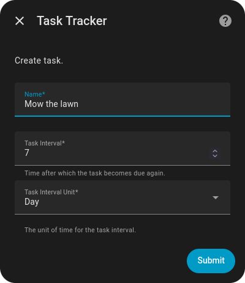
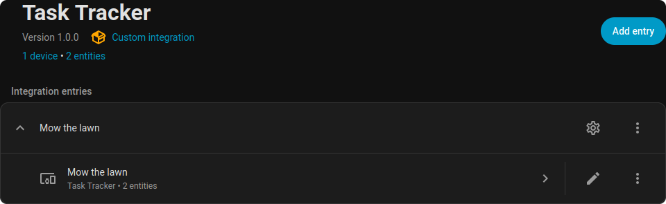
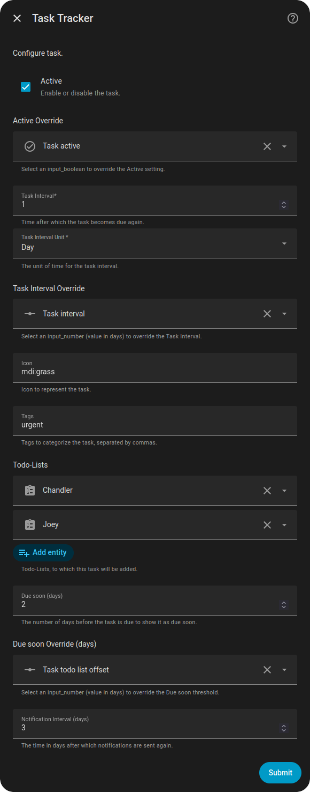
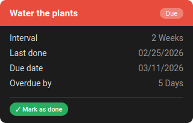
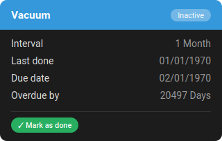
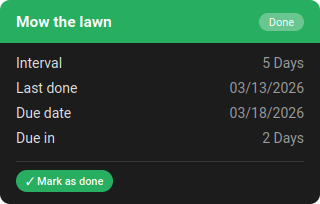

# Task Tracker

This custom component allows you to create recurring tasks, tracks when they were last done and shows you when they will
be due again. The tasks can also be automatically added to local todo lists.

## Installation

The easiest way is to install this custom component through [HACS](https://hacs.xyz). Alternatively you can download or
clone this repository to your Home Assistant `config` folder to `custom_components/task_tracker`.

## Documentation

### Task creation

To create a new task in Home Assistant, go to `Settings > Devices & Services` and click on `Add integration`. Search for
`Task Tracker` and click on it. A dialog will appear where you can enter the data for the task.



* The name is used to display the task.
* The task interval in combination with the task interval unit is used to determine when the task will be due again
  after it was done.

### Task options

After creating a task, you will find a new entry on the integration page.



Through the cog icon you have access to the task's settings.



* The option `active` allows you to pause tasks - the task's sensor will then have the state `inactive`.
* The task interval and unit can be changed here as well.
* The Material Design Icon will be used for the status sensor and is also available as an attribute to be used in
  notifications.
* Tags allow you to add arbitrary keywords to a task which can be filtered for in automations/templates. You could for
  example add assignees here or the time when you want to receive a notification for the task. You must filter for these
  tags yourself, though.
* You can pick todo lists form the `Local Todo` integration to which the task will be added automatically when it is
  due. You can pick multiple lists here.
* The todo list offset allows you to add the task to the todo list a certain time before it is due. This way you can
  prepare for upcoming tasks.
* The notification interval doesn't do anything in and of itself, but can be used in automations/templates to finetune
  when a notification for a task should be sent.

### Lovelace card

This custom component also adds a custom card to Lovelace which can be used to display a task.

```
- type: custom:task-tracker-card
  entity: sensor.task_tracker_mow_the_lawn
```





The check icon in the upper right corner can be clicked to mark the task as done.

### Todo list synchronization

A task will be added to the linked todo lists `n` days before it is due, where `n` is the todo list offset set in
the task options. If the task is marked as done, the corresponding todo item will be removed from the
lists. If the task is marked as completed in the todo list, it will be marked as done 5 seconds later. This gives you
time to change your mind if you completed the item by accident. Inactive tasks will not be added to the todo lists.

### Services

This custom component adds the following services in the domain `task_tracker`:

* `mark_as_done`: Marks the task as done, updating the last done date to today.
* `set_last_done_date`: Sets the last done date to a new value specified by the parameter `date`. This is
  useful to fill the initial last done date when creating tasks or to correct mistakes.

### Example automation

This automation sends a notification at 8 am every day for all tasks that are due and where the notification interval is
met. The recipients are determined based on the tags of each task.

```
alias: Task Tracker
description: "Notify about due tasks"
triggers:
  - trigger: time
    at: "8:00:00"
conditions: []
actions:
  - variables:
      tasks: |-
        [  
          
            
            
            
            
              {%- if overdue_by % notification_interval == 0 %}
                "{{ entity_id }}",
              
            
          
          ]
  - repeat:
      for_each: "{{ tasks }}"
      sequence:
        - alias: Chandler
          if:
            - condition: template
              value_template: "{{ 'chandler' in states[repeat.item].attributes.tags }}"
          then:
            - action: notify.mobile_app_chandler
              metadata: {}
              data:
                title: "{{ states[repeat.item].attributes.friendly_name }}"
                message: >-
                  

                  

                  due since {{ 'today' if overdue_by == 0 else
                  ('yesterday' if overdue_by == 1 else overdue_by) }} {{
                  'days' if overdue_by > 1 }}
                data:
                  tag: "{{ repeat.item }}"
                  color: green
                  group: "{{ repeat.item }}"
                  notification_icon: "{{ states[repeat.item].attributes.icon }}"
        - alias: Joey
          if:
            - condition: template
              value_template: "{{ 'joey' in states[repeat.item].attributes.tags }}"
          then:
            - action: notify.mobile_app_joey
              metadata: {}
              data:
                title: "{{ states[repeat.item].attributes.friendly_name }}"
                message: >-
                  

                  

                  due since {{ 'today' if overdue_by == 0 else
                  ('yesterday' if overdue_by == 1 else overdue_by) }} {{
                  'days' if overdue_by > 1 }}
                data:
                  tag: "{{ repeat.item }}"
                  color: green
                  group: "{{ repeat.item }}"
                  notification_icon: "{{ states[repeat.item].attributes.icon }}"
          enabled: true
mode: single
```

## Further development

If there is demand, I might consider these changes for upcoming releases:

* The notification interval is something I find useful - maybe most people don't need it or someone has a better idea.
* Further translations if people are willing to contribute to their language