# 📋 Task Tracker

[](https://github.com/custom-components/hacs)
[](https://github.com/gensyn/task_tracker/releases)
[](https://opensource.org/licenses/MIT)

A powerful Home Assistant custom component for managing recurring tasks with automatic tracking and todo list integration.

---

## ✨ Features

- ✅ **Recurring Task Management** - Create tasks with flexible repeat modes: after completion or on a fixed schedule
- 📅 **Automatic Due Date Tracking** - Never forget when a task needs to be done
- 📝 **Todo List Integration** - Automatically sync with Home Assistant's Local Todo lists
- 🎨 **Custom Lovelace Card** - Beautiful task display in Lovelace
- 📊 **Sidebar Panel** - Auto-registered dashboard showing all tasks at a glance with state filtering
- 🏷️ **Tagging System** - Organize tasks with custom tags for filtering and automation
- 🔔 **Notification Support** - Built-in attributes for creating smart notification automations
- ⏸️ **Task Activation Control** - Pause tasks when needed without deleting them

---

## 🚀 Installation

### HACS (Recommended)

[](https://my.home-assistant.io/redirect/hacs_repository/?owner=gensyn&repository=task_tracker&category=integration)

1. Click the badge above or search for **Task Tracker** in HACS
2. Click **Download**
3. Restart Home Assistant
4. Add the integration via `Settings > Devices & Services > Add Integration`

### Manual Installation

1. Download or clone this repository
2. Copy the `task_tracker` folder to your Home Assistant `config/custom_components` directory
3. Restart Home Assistant
4. Add the integration via `Settings > Devices & Services > Add Integration`

---

## 📖 Documentation

### 🆕 Task Creation

To create a new task:

1. Navigate to `Settings > Devices & Services`
2. Click `Add Integration`
3. Search for **Task Tracker**
4. Fill in the task details:
   - **Name** - Display name for your task
   - **Repeat Mode** - How the due date is recalculated (see [Repeat Modes](#-repeat-modes) below)

<table>
<tr>
<td>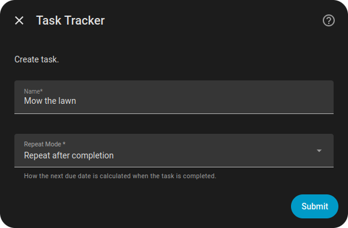<br/><b>Enter name and select mode</b></td>
<td>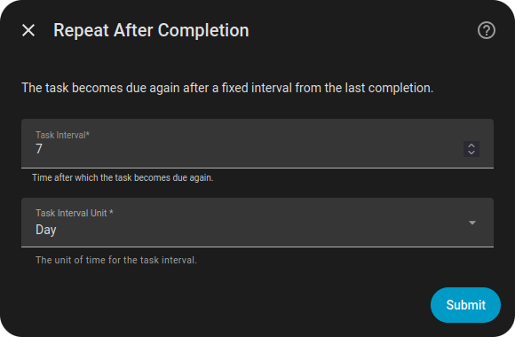<br/><b>Repeat After Completion</b></td>
</tr>
<tr>
<td>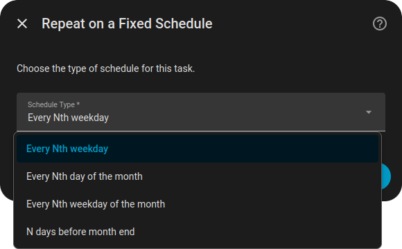<br/><b>Repeat on a Fixed Schedule</b></td>
<td>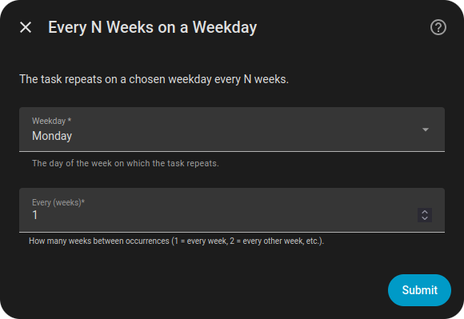<br/><b>Example for Repeat After Completion:<br/>Repeat Every N Weeks on a Weekday</b></td>
</tr>
</table>

Depending on the chosen repeat mode, you will be guided through one or more additional steps to configure the schedule details (see [Repeat Modes](#-repeat-modes)).

---

## 🔄 Repeat Modes

Task Tracker supports two repeat modes, selected during task creation and changeable at any time via the task options.

### Repeat after completion

The next due date is calculated **relative to when the task was last completed**. For example, if a task has a 7-day interval and you complete it on a Wednesday, the next due date will be the following Wednesday — regardless of the original schedule.

**Schedule configuration:** Choose a numeric interval and a unit (Day / Week / Month / Year).

| Field | Description |
|-------|-------------|
| **Task Interval** | How many units between completions |
| **Task Interval Unit** | Day, Week, Month, or Year |

### Repeat every (fixed schedule)

The task repeats on a **fixed calendar schedule**, independent of when it was completed. Completing early or late does not shift the next due date.

**Schedule types:**

| Schedule Type | Description | Example |
|---------------|-------------|---------|
| **Every Nth weekday** | Every *N* weeks on a chosen day of the week | Every week on Monday; Every 2 weeks on Friday |
| **Every Nth day of the month** | A fixed day number each month | Every 15th of the month |
| **Every Nth weekday of the month** | A specific occurrence of a weekday each month | Every 2nd Tuesday; Every last Friday |
| **N days before month end** | A fixed number of days before the last day of the month | 3 days before month end |

#### Mark as done behaviour for fixed schedules

- When a task is **due** (or overdue): marking it done records the most recent past occurrence as the completion date.
- When a task is **due soon**: marking it done records the next upcoming occurrence, so no occurrence is accidentally skipped.
- When a task is **done**: marking it done has no effect.

---

### ⚙️ Task Options

Access task settings through the cog icon ⚙️ on the integration page. 

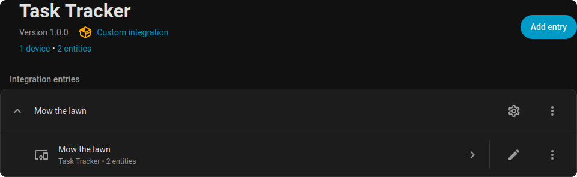

#### Available Options

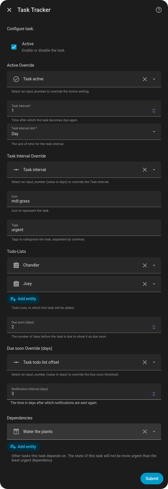

| Option                    | Description                                                                                                     |
|---------------------------|-----------------------------------------------------------------------------------------------------------------|
| **Active**                | Pause tasks when disabled (sensor shows `inactive` state)                                                       |
| **Active Override**       | Select an `input_boolean` helper to override the Active setting at runtime                                      |
| **Icon**                  | Choose an icon for the sensor (available as attribute for notifications)                                        |
| **Tags**                  | Add keywords for filtering in automations/templates (e.g., assignees, notification times)                       |
| **Todo Lists**            | Select Todo lists for automatic task addition when due or due soon                                              |
| **Due Soon**              | Number of days before due date when the sensor switches to `due_soon` state and the task is added to todo lists |
| **Due Soon Override**     | Select an `input_number` helper (value in days) to override the Due Soon threshold at runtime                   |
| **Notification Interval** | Reference value for automation/template notification timing                                                     |

**Options specific to *Repeat after completion*:**

| Option                     | Description                                                                              |
|----------------------------|------------------------------------------------------------------------------------------|
| **Task Interval & Unit**   | Modify how often the task repeats                                                        |
| **Task Interval Override** | Select an `input_number` helper (value in days) to override the Task Interval at runtime |

**Options specific to *Repeat Every Nth weekday*:**

| Option            | Description                                   |
|-------------------|-----------------------------------------------|
| **Weekday**       | Modify the weekday                            |
| **Every (weeks)** | Modify the number of weeks between occurences |

**Options specific to *Repeat Every Nth Day of the Month*:**

| Option              | Description           |
|---------------------|-----------------------|
| **Day Of Month**    | Modify the day number |

**Options specific to *Repeat Every Nth weekday of the month *:**

| Option        | Description                         |
|---------------|-------------------------------------|
| **Weekday**   | Modify the weekday                  |
| **Occurence** | Modify the occurence of the weekday |

**Options specific to *Repeat Every N Days Before the End of the Month*:**

| Option                    | Description                                      |
|---------------------------|--------------------------------------------------|
| **Days Before Month end** | Modify the number of days before the month's end |

> **Note:** Tags and notification intervals require you to implement filtering logic in your own automations.
>
> **Override fields:** When an override helper is selected, its current value takes precedence over the configured option. If the helper is `unavailable` or `unknown`, the configured value is used as a fallback. Override values react to helper state changes in real time, allowing non-admin users to adjust task behaviour through dashboard tiles or scripts without needing access to integration settings.

---

### 🎴 Lovelace Card

Display tasks beautifully with the included custom card.  Click the ✓ icon to mark tasks complete.

```yaml
type: custom:task-tracker-card
entity: sensor.task_tracker_mow_the_lawn
```

The card shows the schedule in a human-readable form that reflects the repeat mode:

- **Repeat after completion** — displays the interval, e.g. *Every 3 days*, *Every 2 weeks*
- **Repeat every (fixed schedule)** — displays the calendar schedule, e.g. *Every week on Monday*, *Every 15th*, *Every 2nd Tuesday*, *3 days before month end*

#### Card States

<table>
<tr>
<td>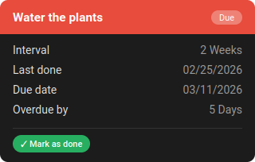<br/><b>Due</b></td>
<td>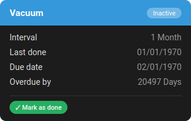<br/><b>Inactive</b></td>
<td>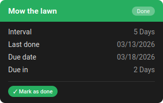<br/><b>Done</b></td>
<td>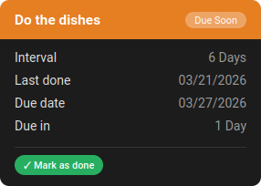<br/><b>Due soon</b></td>
</tr>
</table>

---

### 📊 Sidebar Panel

A **Task Tracker** entry is automatically added to your Home Assistant sidebar when the integration is installed — no manual dashboard setup required.

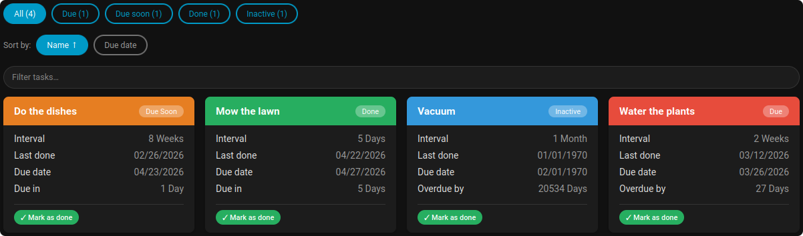

The panel shows all tasks in one place with live state filtering:

| Filter | Shows |
|--------|-------|
| **All** | Every task |
| **Due** | Tasks that are due or overdue |
| **Due soon** | Tasks that will be due within the configured Due Soon threshold |
| **Done** | Tasks completed within their current interval |
| **Inactive** | Tasks with the *Active* option turned off |

Each task card displays the same information as the Lovelace card (status, schedule, last done date, due date, days until due / overdue by) and includes a ✓ button to mark the task as done immediately.

#### Disabling the sidebar panel

If you do not want the panel to appear in the sidebar, add the following to your `configuration.yaml` and restart Home Assistant:

```yaml
task_tracker:
  show_panel: false
```

> **Note:** Individual users can also hide or reorder sidebar items without changing any configuration via **Profile → Sidebar customization** in Home Assistant.

---

### 🔄 Todo List Synchronization

Task Tracker seamlessly integrates with Home Assistant's Local Todo lists: 

- **Auto-Add**:  Tasks appear `n` days before due (based on the Due Soon setting)
- **Auto-Remove**: Completed tasks are removed from todo lists
- **Bi-directional Sync**:  Completing a todo item marks the task done after 5 seconds (grace period for accidental clicks)
- **Smart Filtering**:  Inactive tasks won't be added to todo lists

---

### 🔧 Services

Task Tracker provides the following services in the `task_tracker` domain:

#### `task_tracker.mark_as_done`

Marks a task as completed by setting the last done date to:
  - today, for mode "repeat after completion"
  - the date of the previous occurrence (might be today), for mode "repeat every (fixed schedule)" when in state DUE
  - the date of the next occurrence, for mode "repeat every (fixed schedule)" when in state DUE_SOON

Then recalculates the next due date.

**Example:**
```yaml
action: task_tracker.mark_as_done
target:
  entity_id: sensor.task_tracker_mow_the_lawn
```
<br />

#### `task_tracker.set_last_done_date`
Sets the last done date to a specific value. Useful for:
- Recording tasks completed outside Home Assistant
- Correcting mistakes
- Setting initial state when adding existing recurring tasks

**Parameters:**
- `date` (required) - The last done date in `YYYY-MM-DD` format

**Example:**
```yaml
action: task_tracker.set_last_done_date
target:
  entity_id: sensor.task_tracker_mow_the_lawn
data:
  date: "2026-01-01"
```

> **Note:** After setting the last done date, the task's next due date will be automatically recalculated based on your configured interval.

---

### 🤖 Example Automation

Daily notification at 8 AM for due tasks, with assignee-based routing:

```yaml
alias: Task Tracker
description: Notify about due tasks
triggers:
  - trigger: time
    at: "8:00:00"
conditions: []
actions:
  - variables:
      tasks: |-
        [  
          
            
            
            
            
              {%- if overdue_by % notification_interval == 0 %}
                "{{ entity_id }}",
              
            
          
          ]
  - repeat:
      for_each: "{{ tasks }}"
      sequence:
        - alias: Notify User
          if:
            - condition: template
              value_template: "{{ 'user_tag' in states[repeat.item].attributes.tags }}"
          then:
            - action: notify.mobile_app_user
              data:
                title: "{{ states[repeat.item].attributes.friendly_name }}"
                message: >-
                   due since {{ 'today' if overdue_by == 0 else ('yesterday'
                  if overdue_by == 1 else overdue_by ~ ' days') }}
                data:
                  tag: "{{ repeat.item }}"
                  color: green
                  group: "{{ repeat.item }}"
                  notification_icon: "{{ states[repeat.item].attributes.icon }}"
mode: single
```

---

## 🚧 Future Development

Have ideas or feature requests? I'm open to suggestions!

- 💭 **Notification Interval Refinement** - Gather feedback on current implementation or explore alternatives
- 🌍 **Additional Translations** - Community contributions welcome for your language
- 🎯 **Your Ideas** - Open an issue to suggest new features! 

---

## 🤝 Contributing

Contributions are welcome! Feel free to: 
- 🐛 Report bugs via [Issues](https://github.com/gensyn/task_tracker/issues)
- 💡 Suggest features
- 🌐 Contribute translations
- 📝 Improve documentation

---

## 📄 License

This project is licensed under the terms specified in the [MIT License](https://mit-license.org/).

---

## ⭐ Support

If you find Task Tracker useful, please consider giving it a star on GitHub! It helps others discover the project. 